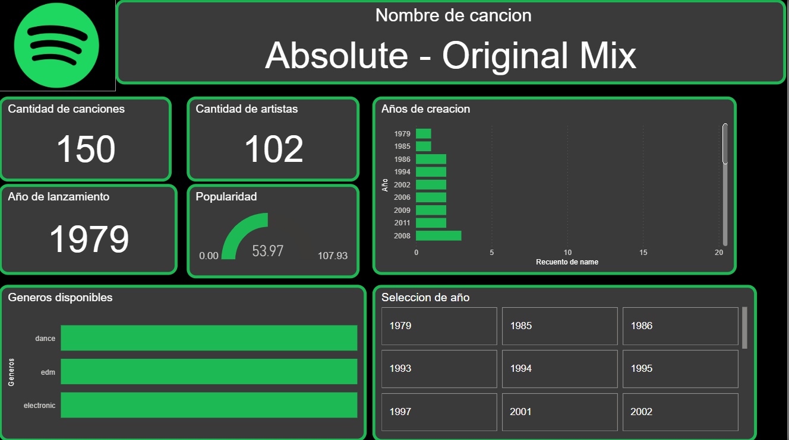

# 🎧 Proyecto ETL con la API de Spotify: Análisis de géneros EDM, Dance y Electronic

Este proyecto consiste en un pipeline ETL (Extracción, Transformación y Carga) aplicado a datos musicales obtenidos desde la API oficial de Spotify. El objetivo principal fue extraer y analizar información relacionada a los géneros **EDM**, **Dance** y **Electronic**, para luego visualizarla a través de un dashboard interactivo en **Power BI**.

---

## 🚀 Tecnologías utilizadas

- **Python** 🐍 – Para la extracción y procesamiento de datos.
- **Spotify Web API** – Fuente oficial de datos musicales.
- **Pandas** – Manipulación de datasets.
- **Power BI** 📊 – Visualización de datos.
- **CSV** – Almacenamiento de datos local para su posterior análisis.

---

---

## ⚙️ ¿Cómo se desarrolló el proyecto?

### 1. Conexión con la API de Spotify
- Se creó una aplicación en el [Spotify Developer Dashboard](https://developer.spotify.com/dashboard/applications).
- Se obtuvieron las credenciales (Client ID y Client Secret) necesarias para autenticar las peticiones a la API.
  
### 2. Extracción de datos
- Se consultaron datos relacionados a canciones que pertenecen a los géneros **EDM**, **Dance** y **Electronic**.
- Se recolectaron atributos como: nombre de canción, artista, año de lanzamiento, popularidad y género.
- Los datos extraídos se almacenaron en un archivo `CSV`.

### 3. Análisis de datos
- Se realizó una limpieza y transformación de los datos con Python.
- Se analizaron métricas como:
  - Cantidad de canciones
  - Cantidad de artistas únicos
  - Años de lanzamiento
  - Popularidad promedio
  - Distribución por género musical

### 4. Visualización en Power BI
- Se creó un dashboard interactivo que permite explorar:
  - 🎵 Nombre de canción y artista
  - 📈 Año de creación y lanzamiento
  - ⭐ Nivel de popularidad
  - 🎧 Géneros disponibles
  - 📅 Filtros por año

---

## 📂 Archivos incluidos

- `etl_spotify.py` → Script Python para la conexión con la API y generación del CSV.
- `canciones_generos.csv` → Dataset generado con los datos extraídos.
- `df46d25b-8109-463b-96c5-6b798c00ccf4.png` → Imagen del dashboard realizado en Power BI.
- `README.md` → Este archivo.

---

## 📌 Próximos pasos

- Implementar almacenamiento en una base de datos relacional (ej. PostgreSQL).
- Automatizar el pipeline ETL con Airflow o similar.
- Publicar el dashboard con Power BI Service o Power BI Embedded.

---

## 📫 Contacto

> Daniel Dziektierow  
> 💼 Analista de Sistemas | Desarrollador RPA | Entusiasta en BigData |Apasionado por la música y la tecnología  
> 📍 Argentina

---

Gracias por visitar este proyecto 🎶 ¡Estás invitado a clonar, contribuir o dejar tu feedback!
