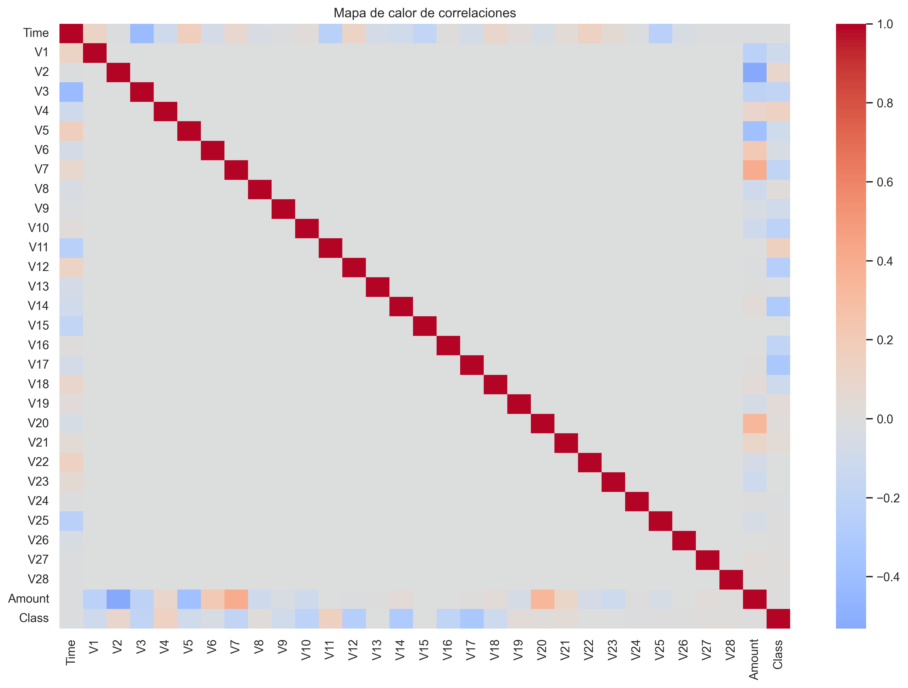

# 💳 Detección de Fraudes en Tarjetas de Crédito

## 📌 Descripción del Proyecto
Este proyecto tiene como objetivo **analizar transacciones con tarjeta de crédito** para identificar patrones de fraude.  

Se realizó un **Análisis Exploratorio de Datos (EDA)** en **Python** y se construyó un **dashboard interactivo en Power BI**, con el fin de mostrar hallazgos clave y facilitar la interpretación de los resultados.

El dataset utilizado es público y contiene transacciones anonimizadas con un fuerte **desbalance de clases** (fraudes = 0.17% del total).

---

## ⚙️ Tecnologías Utilizadas
- **Python:** Pandas, Numpy, Matplotlib, Seaborn  
- **Power BI:** Visualizaciones interactivas, KPIs, filtros dinámicos  
- **GitHub:** Gestión de proyecto y portfolio  

---

## 📊 Análisis en Python (EDA)
En el notebook de Python (`/notebooks/eda_fraud.ipynb`) se desarrollaron los siguientes pasos:

- **Distribución de la variable objetivo (`Class`)** → evidencia un dataset desbalanceado.  
- **Análisis de montos (`Amount`)** → fraudes frecuentes en transacciones de bajo/medio valor (< 100 USD).  
- **Correlaciones entre variables (`V1–V28`)** → `V14` y `V17` muestran alta relación con fraude.  
- **Boxplots comparativos** → permiten visualizar cómo ciertas variables diferencian fraudes de no fraudes.  
- **Análisis temporal (`Time`)** → detección de patrones por hora de transacción.  

Ejemplo de visualización generada en Python:  


---

## 📈 Dashboard en Power BI
El dashboard se diseñó con tres páginas principales:

### 1️⃣ Resumen Ejecutivo  
- KPIs: Total de transacciones, total fraudes y % fraudes.  
- Gráfico de barras: Fraudes vs No Fraudes.  
- Timeline de fraudes.  

### 2️⃣ Exploración  
- Filtros interactivos por rango de **monto** y **tiempo**.  
- Tabla comparativa con métricas descriptivas por clase.  
- Imagen de **mapa de calor de correlaciones** exportado desde Python.  

### 3️⃣ Insights  
- Textos explicativos de los hallazgos.  
- Ejemplo:  
  > “Los fraudes ocurren mayormente en transacciones **< 100 USD** y están correlacionados con las variables **V14 y V17**.”

👉 El archivo del dashboard se encuentra en: `/powerbi/dashboard.pbix`

---

## 📌 Conclusiones
- Los fraudes representan solo **0.17%** de las transacciones.  
- No siempre corresponden a montos altos: muchos ocurren en valores bajos-medios.  
- Las variables `V14` y `V17` se destacan como predictores clave.  
- El dataset altamente desbalanceado requiere **métricas como Precision, Recall y F1-score**, en lugar de solo Accuracy.  

---

## 🚀 Cómo usar este proyecto
1. Clonar el repositorio:  
   ```bash
   git clone https://github.com/tuusuario/fraud-detection-eda.git
